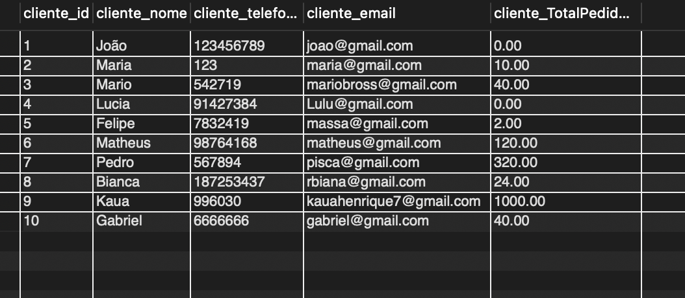
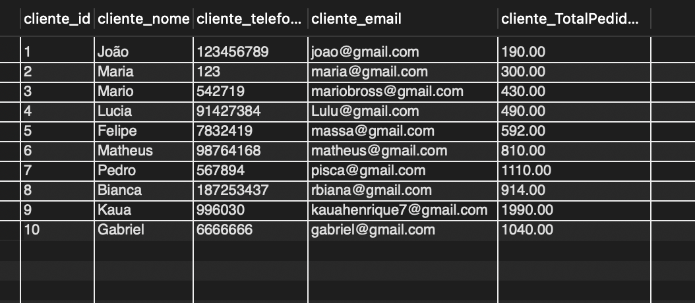
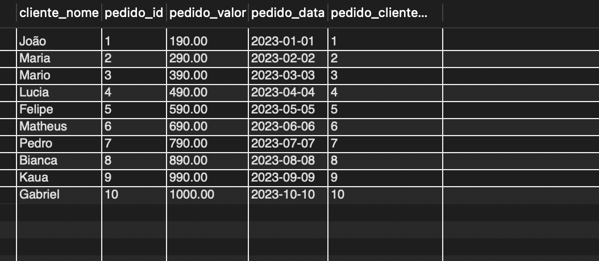
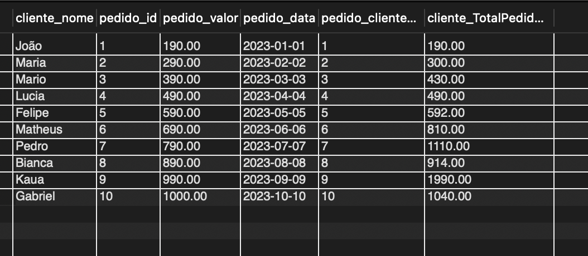

# Gerenciamento De Pedidos AF

## Objetivo: 
Criar um sistema de gerenciamento de pedidos em um banco de dados utilizando stored procedures, triggers, views e JOINs no MySQL Workbench.

## Etapa 1: Criação de Tabelas e Inserção de Dados
Crie as tabelas "Clientes" e "Pedidos" com campos apropriados. Insira dados de exemplo nas tabelas para simular clientes e pedidos. Certifique-se de incluir uma chave primária em cada tabela.

### [Codigo](CriandoTabela.sql)

## Etapa 2: Criação de Stored Procedure

Crie uma stored procedure chamada "InserirPedido" que permite inserir um novo pedido na tabela "Pedidos" com as informações apropriadas. A stored procedure deve receber parâmetros como o ID do cliente e os detalhes do pedido. Ao término teste o funcionamento da stored procedure criada inserindo um pedido.

## Etapa 3: Trigger

Crie uma trigger que seja acionada APÓS a inserção de um novo pedido na tabela "Pedidos". A trigger deve calcular o valor total dos pedidos para o cliente correspondente e atualizar um campo "TotalPedidos" na tabela "Clientes" com o valor total. Teste a Trigger inserindo um novo pedido na tabela "Pedidos“.

Print antes de adicionar os pedidos e criar o Trigger

Print depois de adicionar os pedidos e criar o Trigger

### [Codigo](StoredETrigger.sql)

## Etapa 4: View

Crie uma view chamada "PedidosClientes" que combina informações das tabelas "Clientes" e "Pedidos" usando JOIN para mostrar os detalhes dos pedidos e os nomes dos clientes.

## Etapa 5: Consulta com JOIN

Escreva uma consulta SQL que utiliza JOIN para listar os detalhes dos pedidos de cada cliente, incluindo o nome do cliente e o valor total de seus pedidos. Utilize a view "PedidosClientes" para essa consulta.

### [Codigo](ViewJoin.sql)
