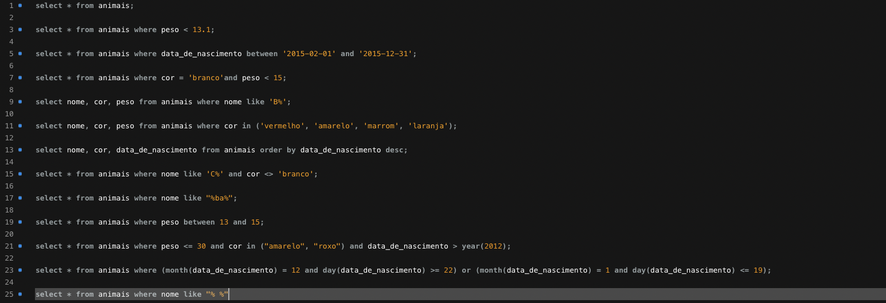
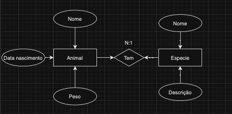
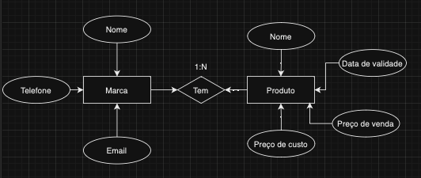
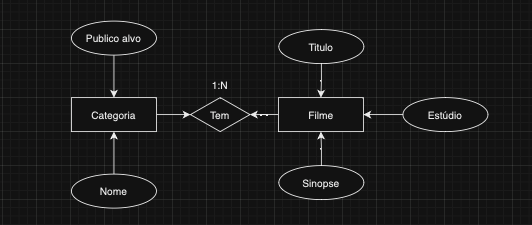

# Etapa 1 

Crie a tabela animais, conforme o exemplo demonstrado, durante a aula do dia 11/09/23;

[Codigo](CriandoATabelaAnimais.sql)

Insira todos os valores disponíveis no slide 8;

Após a inserção execute cada uma das atividades a seguir:

Selecione todos os animais
Selecione todos os animais que pesam menos que 13.1
Selecione todos nasceram entre fevereiro e dezembro de 2015
Selecione todos os animais brancos que pesam menos que 15.0
Selecione nome, cor e peso de todos cujo nome comece com ’B’
Selecione nome, cor e peso de todos com cor vermelha, amarela, marrom e laranja
Selecione nome, cor, data de nascimento e peso de todos ordenados pelos mais jovens
Selecione todos os animais cujo nome comece com 'C' e não sejam brancos
Selecione todos os animais cujo nome contenha 'ba'
Selecione todos os animais com peso entre 13.0 à 15.0
Selecione todos os animais que o peso não seja maior que 30, com cor amarelo ou roxo e nascidos depois de 2012
(Desafio) Selecione todos os capricornianos
(Desafio) Selecione todos os animais com nome formado por mais de uma palavra.

[Codigo](selectsAnimias.sql)

# Etapa 2

1) Crie um banco de dados para armazenar dados de Animais e Espécies. Um animal tem seu nome, data_nasc e peso. Uma espécie tem um nome e uma descrição.

Faça a modelagem relacional, DER.

Insira pelo menos 8 animais e 3 espécies.

[Codigo](AnimaisEEspecies.sql)

2) Crie um banco de dados para registrar dados de Produtos e Marcas. Um produto deve ter nome, preço de custo, preço de venda, data de validade e marca. Uma marca deve ter, nome, email e telefone.

Faça a modelagem relacional, DER.

Insira pelo menos 8 Produtos e 3 Marcas.

[Codigo](ProdutosEMarcas.sql)

3) Crie um banco de dados para registrar dados de Filmes e Categorias. Um filme tem seu título, sinopse, estudio e categoria. Uma categoria deve ter nome e público alvo.

Faça a modelagem relacional, DER.

Insira pelo menos 8 Filmes e 3 Categorias.

[Codigo](FilmesCategorias.sql)

