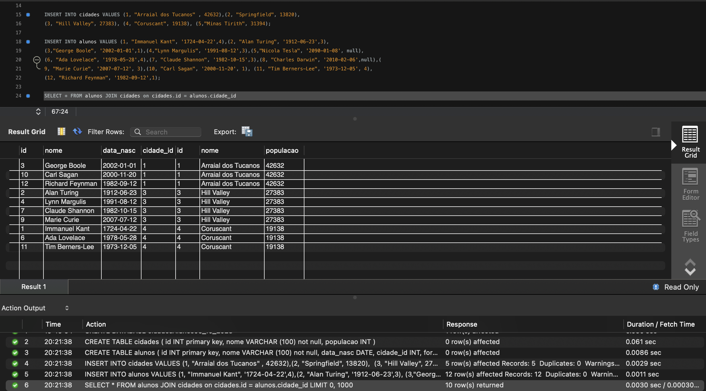

# Exercicio Cidades e Alunos 09/10/2023

Crie duas tabelas conforme o modelo apresentado nos slides 61 e 62, no material da AULA 7;

Preste atenção aos campos que estão no exemplo;

Insira os valores conforme os slides;

Aplique o exemplo sobre inner join dado no slide 67, do material indicado acima;

Execute essas atividades dentro o Oracle Workbench;

Crie um repositório remoto e envie o [script](CidadesEAlunos09_10_2023.sql) em SQL;

Produza o Readme do repositório remoto e tire um print da tela após o término da atividade;

Coloque comentários em seu código.

