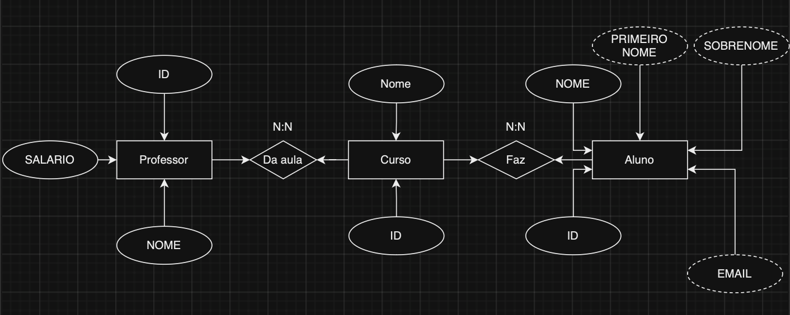
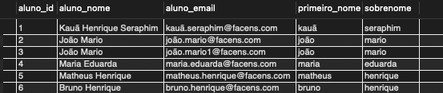
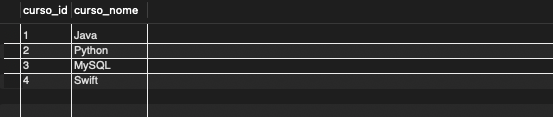
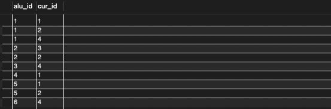
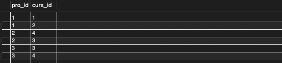

# Exercicio Stored Procedures

## Faça a modelagem do banco e identifique as entidades, seus atributos e relacionamentos;

## Crie o modelo físico do banco de dados (script SQL);
[CODIGO](CriandoAsTabelas.sql)

## Utilize Stored Procedures para automatizar a inserção e seleção dos cursos;
[CODIGO](StoredPRocedures.sql)

