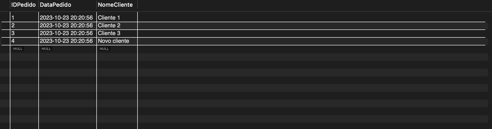
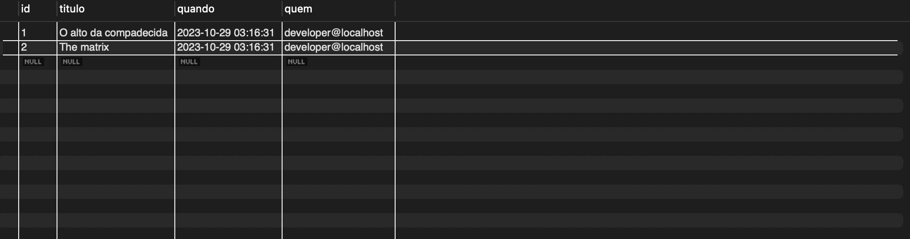
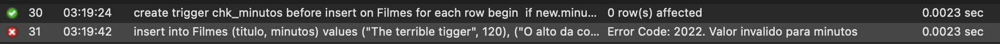

# BancoDeDados

## Exemplo Trigger 1
Codigo do exemplo [aqui](exercicioTriggerPedidos.sql).

## Print do resultado do "gatilho":

## Explicação:
No segundo insert mesmo sem colocar a data e o horario, por conta do gatilho todo valor que for adicionado a tabela "Pedidos" recebera o de data e hora do momento que foi adicionado.

## Exemplo Trigger 2
Scrip da criação da tabela filmes e primeira versão do gatilho [aqui](CriaçãoDaTabelaFilmes.sql)

Scrip do gatilho com erro personalizado e o insert dos valores na tabela [aqui](InserindoOsFilmes.sql)

Scrip da tabela de log deletions e o gatilho que adiciona os logs [aqui](Log_Deletions.sql)

## Print dos logs deletions

## Explicação:
Após criar a tabela dos logs o gatilho irá fazer um insert na tabela quando houver um delete na tabela "Filmes", salvando o titulo do filme, o momento do delete e o user que fez esse delete.

## Print erro personalizado

## Explicação:
O gatilho gera um erro personalizado sempre que o valor do tempo do filme for menor que 0 (O correto nesse caso seria menor ou igual a zero para que filmes com duração de zero minutos também apresentasem esse erro) além do numero do erro ele apresenta a mensagem do motivo do erro
