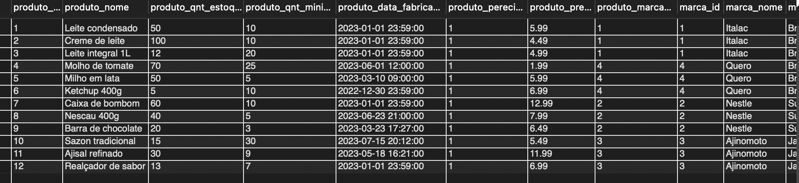
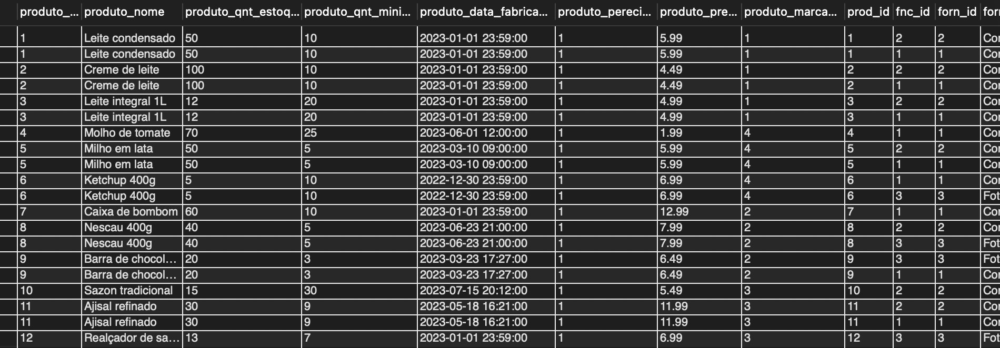
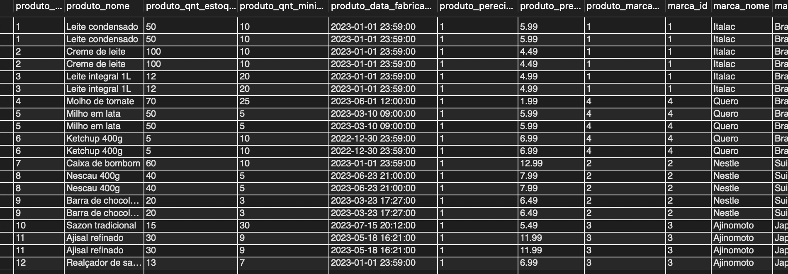
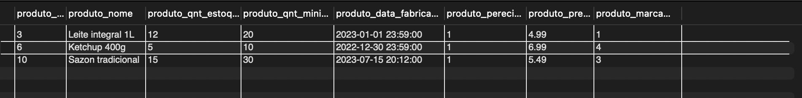
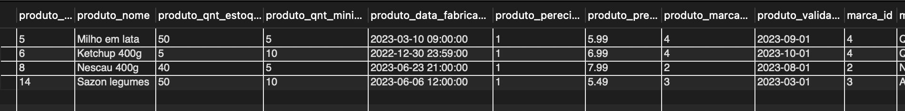
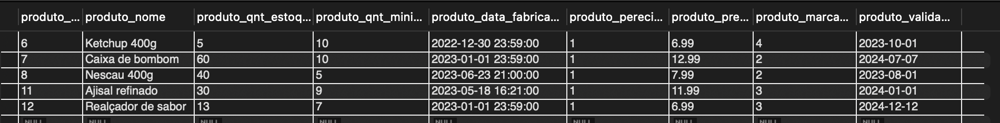

# Exercicio VIEW

## Scrip da criação das tabelas
[AQUI](CriandoAsTabelas.sql)

## Crie uma view que mostra todos os produtos e suas respectivas marcas;

## Crie uma view que mostra todos os produtos e seus respectivos fornecedores;

## Crie uma view que mostra todos os produtos e seus respectivos fornecedores e marcas;

### CODIGO:
[CODIGO](Views1.sql)

## Crie uma view que mostra todos os produtos com estoque abaixo do mínimo;

## Adicione o campo data de validade. Insira novos produtos com essa informação;

## Crie uma view que mostra todos os produtos e suas respectivas marcas com validade vencida;

## Selecionar os produtos com preço acima da média.

### CODIGO:
[CODIGO](VIEW2.sql)
