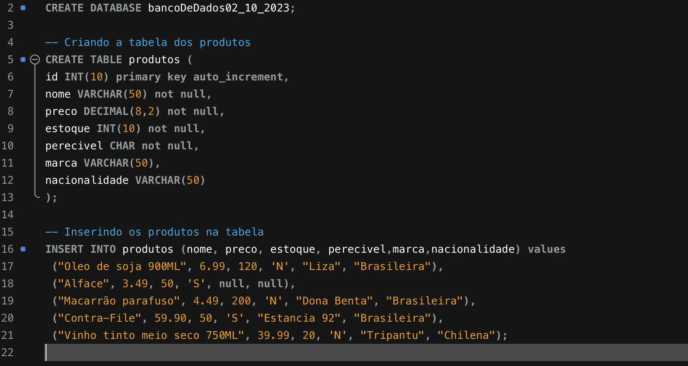
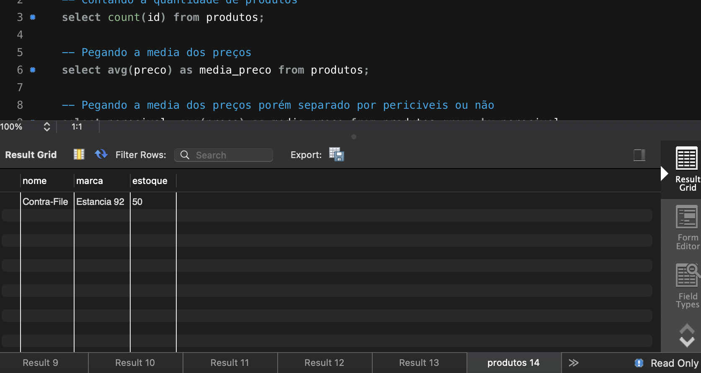
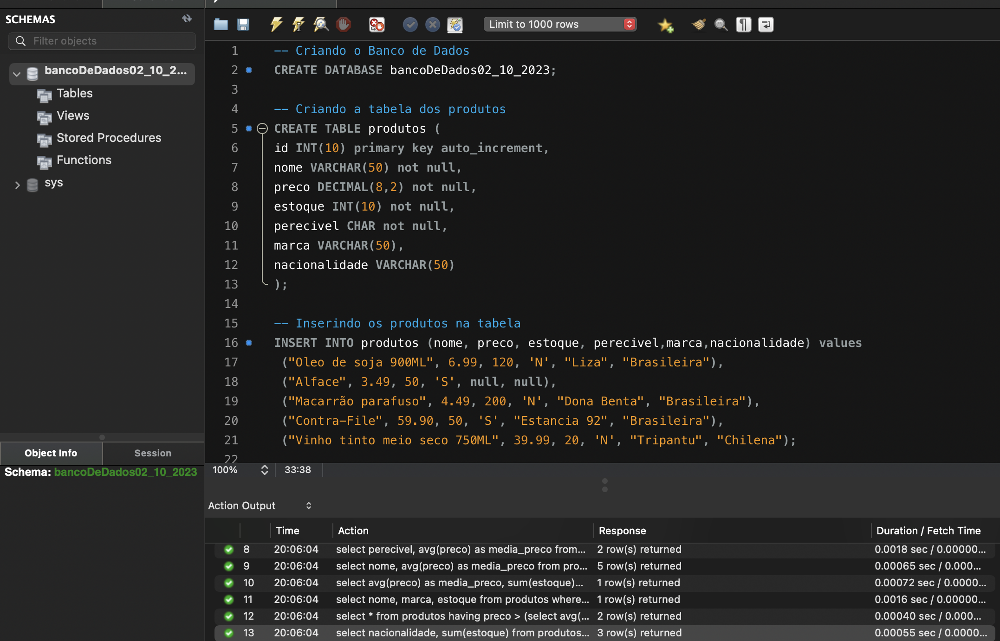

# BancoDeDados

## Etapa 1

Crie uma tabela Produtos com os seguintes itens id_produto; nome; preço;
estoque; perecível; marca; nacionalidade.

Atribua a cada campo seu respectivo tipo.

Os itens: nome; preço; estoque; perecível não poderão receber valores nulos.

O id_produto deve ser utilizado como chave-primaria.

Após a criação insira cinco produtos, todos devem ter seus respectivos campos
preenchidos.

Verifique se todos os dados foram inseridos.

Ao término inicie a segunda etapa.

## Etapa 2

Gere um relatório[relatorio](Quantidade_De_Produtos.csv) informando quantos produtos estão cadastrados.

Gere um relatório[relatorio](Preço_Medio.csv) informando o preço médio dos produtos.

Selecione a média dos preços dos produtos em 2 grupos: perecíveis e não
perecíveis.

Selecione a média dos preços dos produtos agrupados pelo nome do produto.

Selecione a média dos preços e total em estoque dos produtos.

Selecione o nome, marca e quantidade em estoque do produto mais caro.

Selecione os produtos com preço acima da média.

Selecione a quantidade de produtos de cada nacionalidade.

## Etapa 3

Execute toda a atividade no WorkBench da Oracle.

Comente o código esclarecendo o que está sendo feito no bloco de código.

Crie um repositório remoto (GITHUB).

Envie somente o script SQL para o repositório.

Crie o ReadMe com base no modelo disponibilizado em aula.

Tire um print da tela do WorkBench e insira no ReadMe.

Envie na atividade somente o link do repositório criado.

