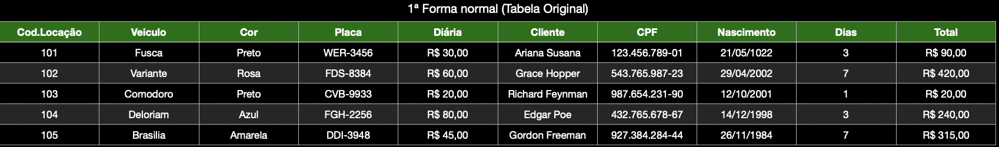
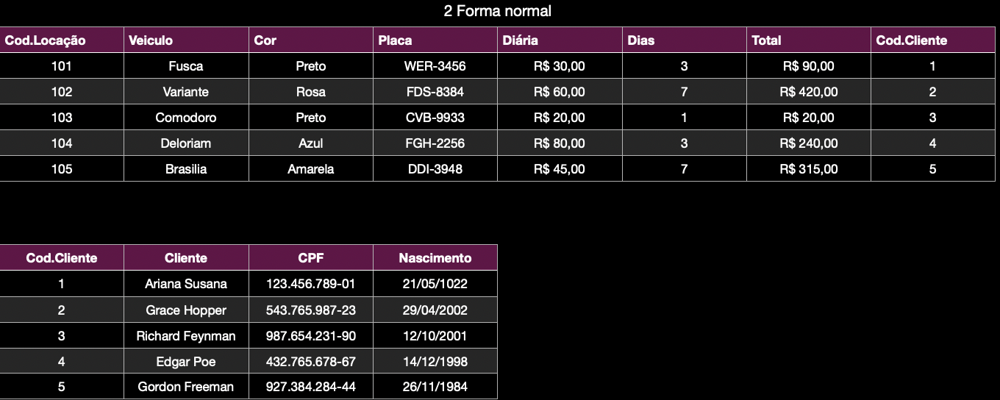
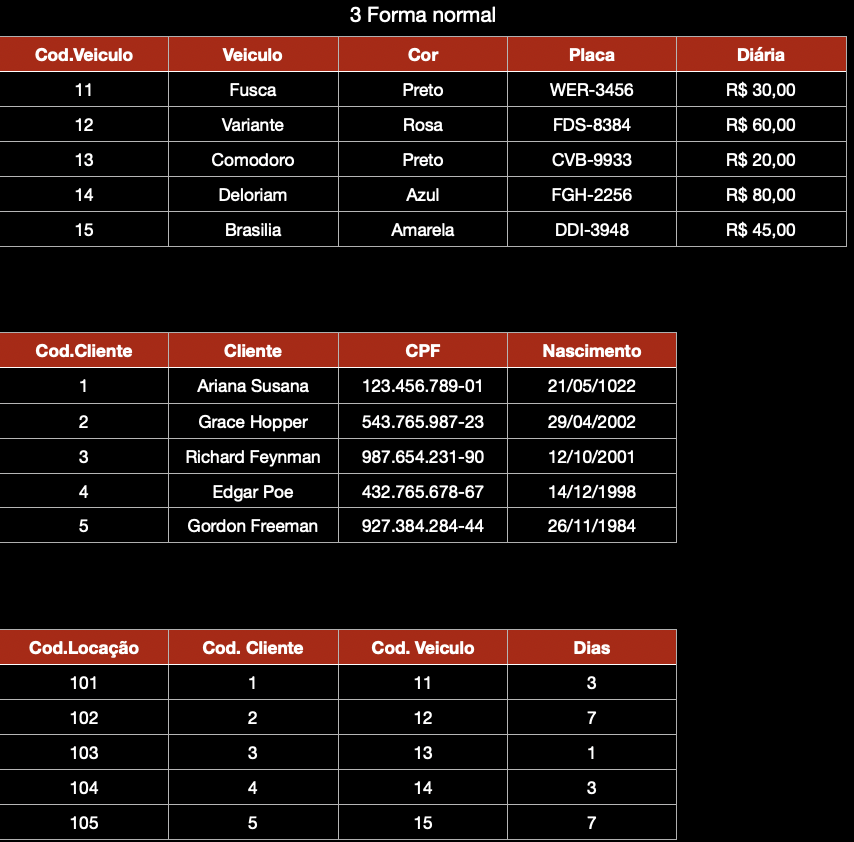

# Locação de Automóveis (NORMALIZAÇÃO)

## 1ª Forma normal.

## 2ª Forma normal.

## 3ª Forma normal.

[TABELAS](TabelasNORMALIZACAO.numbers)

## Observe a tabela não normalizada de uma locadora de veículos e aplique a 3ª Forma normal;

## Escreva o script que cria as tabelas.

[CODIGO](CriandoAsTabelas.sql)

### Adicionando dados.

[CODIGO](AdicionandoDadosATabela.sql)

## Crie uma view que seleciona todas as locações e seus respectivos veículos e clientes.

[CODIGO](View.sql)
