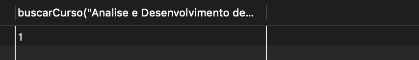

# Sistema Universidade (FUNCTIONS)

## Crie um banco de dados para armazenar alunos e cursos de uma universidade;

[CODIGO](CriandoAsTabelas.sql)

## Utilize Stored Procedures para automatizar a inserção e seleção dos cursos;

## O aluno possui um e-mail que deve ter seu endereço gerado automaticamente no seguinte formato: nome.sobrenome@dominio.com

## Crie uma rotina que recebe os dados de um novo curso e o insere no banco de dados;

[CODIGO](AdicionandoOsDados.sql)

## Crie uma função que recebe o nome de um curso e sua área, em seguida retorna o id do curso;

[CODIGO](CriandoOFunctionsql)

## Crie uma procedure que recebe os dados do aluno e de um curso e faz sua matrícula;
## Caso o aluno já esteja matriculado em um curso, essa matrícula não pode ser realizada;

[CODIGO](Matricula.sql)

